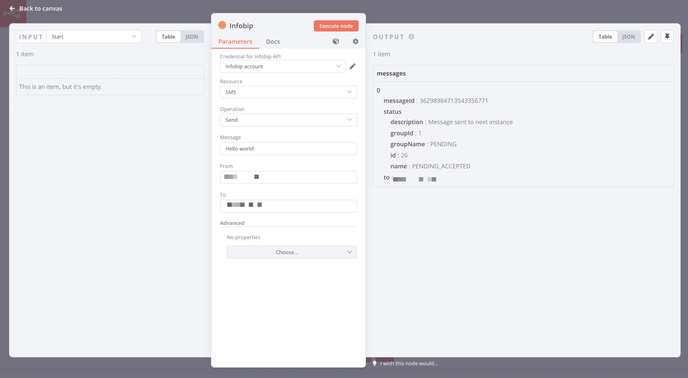

# n8n-nodes-infobip

This is an n8n community node. It lets you use _Infobip_ in your n8n workflows.

[Infobip](https://www.infobip.com/) is a leading messaging and communications platform, providing a cloud solutions for various messaging needs, including bots and transactional APIs for voice, email, SMS/MMS...

This node only supports the SMS API at the moment.

[n8n](https://n8n.io/) is a [fair-code licensed](https://docs.n8n.io/reference/license/) workflow automation platform.

[Installation](#installation)  
[Operations](#operations)  
[Credentials](#credentials)
[Compatibility](#compatibility)  
[Usage](#usage)
[Resources](#resources)  

## Installation

Follow the [installation guide](https://docs.n8n.io/integrations/community-nodes/installation/) in the n8n community nodes documentation.

## Operations

- SMS:
  - Send - send out a single SMS or a bulk to many destinations
  - Dequeue Delivery Report - Get and dequeue delivery status for a given message or bulk
  - Dequeue Received Messages - Fetch and dequeue incoming SMS messages
  - Get Scheduled Messages - See the status and the scheduled time of your SMS messages
  - Get Scheduled Messages Status - See the status of your scheduled SMS messages
  - Search Logs - Get outbound message logs for given search parameters

## Credentials

All API calls require authentication via an API key. Generate one for your account on the [Infobip portal](https://portal.infobip.com/settings/accounts/api-keys).

## Compatibility

Tested against n8n 0.193.5

## Resources

- [n8n community nodes documentation](https://docs.n8n.io/integrations/community-nodes/)
- [Infobip API Docs](https://www.infobip.com/docs/api)
